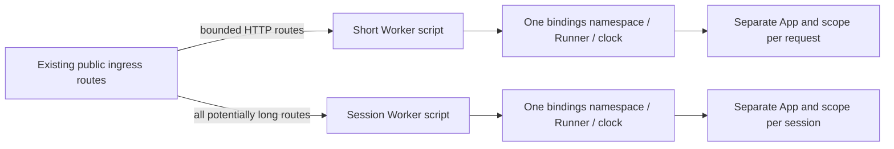

# Workers mixed-session Host profile decision (W02)

Status: **architecture selected; local implementation and qualification complete**.
Date: 2026-09-15. Source baseline: `d7eb465baa2e668ed2378fa832aab1769965a3d9`.
This decision is at the Runtime/Host boundary. It changes neither
Kernel/Plan semantics nor public Capability, HTTP, stream or WebSocket contracts.
Production deployment and platform qualification remain separate work.

## Decision and limits of the claim

Use **two separately deployed Worker scripts**, with disjoint ingress route
assignments: a short-request profile and a session profile. Each script's isolate
owns exactly one generated wasm-bindgen module namespace, one executable Wasm
generation at a time, one Runner and one matching clock module. Do not put two
Runners around the same bindings, and do not import both profiles into one Worker
entry point.

The short profile accepts bounded buffered HTTP work only. The session profile
owns every route that can retain an App after response headers, including HTTP
streams and WebSockets. Both create a new App and event scope for each event.
Long sessions cannot consume the short profile's generation admissions or hold
its retirement open because their mutable JS/Wasm state belongs to another
Worker execution realm. Identical immutable artifact bytes may be deployed to
both scripts; this is not a shared Wasm instance or shared memory object.

This selects deployment isolation over a new multi-instance binding ABI. It
does not promise independent failure for sessions sharing the session Runner,
fleet-wide admission limits, physical CPU isolation, lower latency, lower memory,
or lower cost. Cloudflare placement, account limits and shared durable services
can still affect both profiles. Session traffic can still exhaust its own
bounded generation and receive backpressure. That is an explicit profile limit.

### Routing is a prerequisite, not an authorization shortcut

Deployment configuration assigns disjoint existing host/path patterns directly
to the two scripts. Preserve the client's URL, method, raw query as exposed by
Fetch, headers, body, credential extraction, Origin checks, subprotocol selection
and Web Ingress authorization. Each destination executes its existing Plan-bound
ingress. A route assignment confers no identity or permission. Never accept a
client header that selects a privileged profile.

Classify from the pinned route/interaction inventory before App admission. A
route that sometimes streams belongs entirely to the session profile, including
its buffered responses and failed upgrades. Do not start it in the short Worker
and transfer its App later. Requests unrelated to those routes must resolve to
the short Worker. Both Hosts fail closed on a route/profile mismatch; no spillover
to the other profile when capacity is exhausted.

Direct routing must be proven with the selected Cloudflare configuration. If the
existing URLs cannot be partitioned without capturing unrelated short traffic
(for example the same route selects a stream based on request content), **stop
that consumer migration**. The coordinator must choose a separately scoped,
transparent dispatcher proof or a revised deployment design. Changing public
URLs or endpoint contracts is not authorized by this decision. Service-binding
proxying, including its cancellation and WebSocket forwarding behavior, is not
silently assumed to work. The primary design has no intermediary JS proxy.

## Source-grounded diagnosis

| Source at the baseline | Relevant behavior |
| --- | --- |
| [Runner](../../packages/workers-runtime/runner.mjs), `execute`, `open`, `rotate`, `abandon` | `admittedCount` increases once per event and does not fall when a short request finishes. Idle retirement defaults to 64 admissions, with an unconditional hard ceiling of 96. `open` retains its pending entry through terminal closure and owner cleanup. |
| [Host](../../packages/workers-runtime/host.mjs), `generatedInstantiate`, `createWorkersHttpHost` | One Runner closes over one generated namespace. `handle_http` is captured from that namespace. The scope/HTTP handler is constructed inside `fetch` to keep request, `env` and `ctx` event-owned. |
| [Exports](../../packages/workers-runtime/index.mjs) and [package contract](../../packages/workers-runtime/README.md) | The high-level entry is buffered HTTP; lower-level `run`/`open` and transport composition remain available. The documented default clock supports one generated module/Runner domain. |
| [Build entry](../../packages/workers-runtime/build.mjs) | Pins Rust 1.94.0 and wasm-bindgen 0.2.127, uses locked Cargo and `--target web --experimental-reset-state-function`, and exports static constructors. |
| [Clock](../../packages/workers-runtime/clock.mjs) and [Driver](../../crates/lenso-workers-driver/src/lib.rs) | Module-level timer Map; `clearTimers()` clears that entire domain. Driver imports the fixed `@lenso/workers-runtime/clock` module. G1/G2 clock files only re-export it. |
| [Scope](../../packages/workers-runtime/scope.mjs) and [HTTP transports](../../packages/workers-runtime/http.mjs) | Synchronous JS-only invalidation fences Wasm delivery; owner continuations abort and settle native I/O. Streams retain the lease, copy memory views and observe `closed`. |
| [G1 Runner](../../experiments/workers-g1/runner.mjs), [README](../../experiments/workers-g1/README.md), [acceptance](../evidence/workers-g1/acceptance.md) | Bounded short-event retirement and same-fetch trap recovery are evidenced. Cross-request native cancellation and a shared rotation Promise previously failed under workerd. |
| [G2 Runner](../../experiments/workers-g2/runner.mjs), [session Host](../../experiments/workers-g2/host/src/sessions.rs), [README](../../experiments/workers-g2/README.md) | Buffered and duplex handlers in this source use the same Runner if composed together. `ResponseSession.closed` retains the App, Driver guard, cancellation guard and body until body completion/cancellation and clean App shutdown. |
| [G2 buffered config](../../experiments/workers-g2/wrangler.jsonc) and [duplex config](../../experiments/workers-g2/wrangler.duplex.jsonc) | Already name distinct Worker deployments. This is a useful composition precedent, not evidence for mixed traffic or public route partitioning. |

The coordinator supplies the reproduced W02 trace: one healthy long session plus
95 completed short requests reaches 96 admissions; later work waits and times
out until that session closes. No trace artifact is present in the listed inputs,
and this design task did not rerun the reproduction. The code explains it exactly:

1. Open session: `admittedCount = 1`, `pending.size = 1` after headers.
2. Complete 95 short events sequentially. Their cleanup removes their pending
   entries, leaving the session; the idle boundary never occurs. Count is 96.
3. A new event cannot enter Wasm. At most 32 rotation waiters poll on their own
   1 ms timers and fail at `eventLimitMs` (default 1,000 ms); further waiters fail
   immediately. Low active concurrency does not reopen cumulative admission.
4. Only clean session shutdown plus cleanup, or generation abandonment, permits
   rotation. Raising concurrency does not address this cause.

### Generated wasm-bindgen lifecycle: why two Runners are unsafe

Generated `pkg` JS is absent in this worktree. Inspection therefore used the
installed **wasm-bindgen-cli-support 0.2.127 generator source**, `src/js/mod.rs`,
alongside the build flags and recorded [G1 lifecycle proof](../evidence/workers-g1/recovery.md).
The exact upstream source is
[version 0.2.127](https://docs.rs/crate/wasm-bindgen-cli-support/0.2.127/source/src/js/mod.rs).
These are generator facts; fresh consumer output inspection remains a gate:

- The web initializer emits module-scope `wasmModule`, `wasmInstance` and `wasm`.
  `initSync` returns the existing `wasm` when initialized. Another call is not an
  independent instance factory. Export wrappers read this mutable module state.
- `generate_reinit_wrappers` emits `__wbg_reset_state`: it increments
  `__wbg_instance_id`, clears emitted memory-view caches and applicable helper
  state (including heap/vector/decoder state), creates a new instance using the
  saved module/imports, replaces `wasm`, and calls `__wbindgen_start`.
  Reset itself instantiates; the Runner's subsequent `initSync` obtains those
  new exports and the Runner calls `__wasm_call_ctors` for static registration.
- Generated closures capture an instance ID and reject obsolete invocations.
  Class wrappers track `__wbg_inst`; finalization callbacks only free pointers
  for the matching instance. Guards prevent stale access; they cannot keep an
  old session executing after the namespace has switched to a new instance.

Thus saving an old `exports.memory`, copying a namespace object, or giving a
second Runner the same `initSync` does not create a second lifecycle domain.
Manually constructing another `WebAssembly.Instance` does not rebind generated
wrappers, imports, closures and finalizers safely. Duplicating just the glue path
also leaves the fixed shared clock import unresolved. A reset in either Runner
could invalidate the other's session and clear its timers. This design never
resets or replaces a singleton with a still-live old generation.

## Ownership and capacity

| Resource | Owner and lifetime |
| --- | --- |
| Compiled code, descriptors, immutable Plan bytes | Cacheable within each Worker isolate; no mutable App embedded in the cache. Recheck expiry of cached verified data at use. |
| Generated glue, Wasm memory/table, constructor registrations, Runner generation counter | Exactly one domain per script isolate. Serialized generation replacement only; no warm standby or still-executing retiring generation. Old unreachable memory remains subject to GC. |
| Credentials, authenticated identity, Driver tasks, mutable Plugin/App graph, storage session | One event, from startup through clean terminal shutdown or failure. Never pooled across events or transferred between scripts. |
| Request/Response streams, WebSocket, controllers, native Promises, `env` resource wrappers, `ctx` | One fetch/session owner context; pass explicit scope bindings to Rust. No module-scope mutable binding table, `globalThis` service locator or cached request I/O. |
| Timers | Driver timers belong to that script's generated clock domain. Runner event/session/watchdog and waiter timers belong to their event. Cleanup timers belong to the owner scope. |
| Receipts | Bounded sanitized diagnostics only. A boot/profile/generation identifier is not a request credential or routing-affinity token. |

Keep existing admission ceilings in **each existing Runner domain**:

| Boundary | Short profile | Session profile |
| --- | --- | --- |
| Active events including startup and cleanup | Configured `maxConcurrent`, default/hard maximum 32 | Same; an open session consumes one slot until terminal cleanup |
| Cumulative generation admissions | Idle retirement at configured threshold, default 64; hard maximum 96 | Same; completed sessions do not refund admissions |
| Hard-ceiling retirement waiters | At most 32, each request-owned, deadline `eventLimitMs` | Same; cannot wait indefinitely for a long session |
| Startup/event watchdog | Existing `eventLimitMs`, default 1,000 ms | Same until headers |
| Active session lifetime | No long-session admission | Existing `sessionLimitMs`, default 300,000 ms after opening |
| Cancellation watchdog | Existing `cancellationLimitMs`, default 1,000 ms | Same; do not restart it on repeated cancel or late headers |
| Scope operations / settlement | Existing default 128 operations and one total 250 ms cleanup deadline | Same, with existing bounded Web frame/queue/stream limits |

Values above are source defaults and ceilings, not newly approved performance
budgets. Preserve any stricter consumer settings, transport bounds and platform
resource limits. Two services do not imply a new 64-event per-isolate limit: they
have different realms. These limits were never an account-wide quota; if a
consumer requires a fleet-wide cap, that requires separate admission ownership
and proof before migration. Do not multiply instances to evade a ceiling.

Acquire a bounded Host transport reservation before body buffering or binding
operations. Count startup, execution and owner cleanup against that profile's
active capacity; count admission waiters separately, at no more than 32. Waiters
must not start an App, buffer a body, or start Plugin/storage I/O. Body/head limits
still apply after reservation. Rejected bodies must be cancelled in the request
owner, with bounded cleanup and observed rejection. Release reservations exactly
once. W01 now reserves transport capacity through Runner preparation before body reads.
The W02 implementation preserves that gate and its regression suite.

Reject active-capacity overload immediately. At generation ceiling, use only the
existing bounded retirement wait/deadline policy; once closed for failure or
uncertain cleanup, reject new work immediately. Preserve the existing pre-header
HTTP `503 host_unavailable`/`request_cancelled` mappings and storage uncertainty
mapping; expose precise capacity reasons in internal receipts, not a new public
error schema. No automatic retry, profile fallback or unbounded JS pending list.

## Retirement, cancellation and failure state machine

For each profile independently:

1. **Admitting:** increment cumulative admissions only when entering the Runner.
   Keep event reservations until cleanup ends. At an idle boundary at or above
   the soft threshold, retire. Without idle time, stop entering at 96 and drain.
2. **Draining:** allow admitted events to finish; no reset at response headers,
   at the soft threshold with live work, or to service a waiter. At the hard
   ceiling, no additional event can prolong the generation. Every remaining
   startup/session has its existing finite watchdog; no heartbeat extends it.
   After the final admission, draining is bounded by remaining startup, session
   and owner-cleanup deadlines, assuming the JS event loop progresses.
3. **Clean retirement:** require all Apps terminal, all Wasm entry leases revoked,
   all owner cleanup confirmed, and no event capable of scheduling more Wasm.
   Clear that domain's remaining Driver timers; reset generated state; obtain
   exports; verify different memory identity; run constructors once for the new
   generation. Only then reopen admission. Failed reset/constructors leave it
   unavailable. Never claim that GC or total process memory shrinks immediately.
4. **Abandonment:** trap, rejected export, watchdog expiry or non-clean session
   terminal closes admission and marks the entire local generation terminal.
   Synchronously invalidate every scope and lease using JS only, reject every
   owning continuation with the abandoned generation identity, and clear that
   domain's Driver timers. The old generation is now terminal, with zero live
   Wasm leases even though native cleanup is outstanding. Without yielding,
   reset that terminal singleton to advance generated instance guards, verify
   fresh memory and initialize constructors, but keep admission closed. This
   prevents queued old finalizers from using the abandoned instance identity.
   Do not defer guard invalidation behind an asynchronous cleanup wait. Owners
   perform native cleanup; no peer directly aborts another request's I/O or
   invokes old Rust cancellation/destructors. This is failed shutdown, never
   clean retirement. No live old generation overlaps the replacement. Reset
   failure remains unavailable; it must not restore the abandoned generation.
5. **Cleanup quarantine:** allow at most one terminal generation's native cleanup
   batch per realm and no replacement admissions while it remains unconfirmed.
   Each owner waits only its configured total cleanup deadline. On timeout/error,
   report uncertainty, retain only the bounded JS cleanup bookkeeping needed to
   observe outstanding native work, and keep that profile unavailable. Do not
   accumulate retired generations or refill operation capacity behind hung I/O.
   At most the single initialized, non-admitting replacement and one terminal
   generation's cleanup batch may be retained; no further reset/retry loop.
   Actual late native completion may release resources, without calling Wasm or
   rewriting the failed receipt. Reopen only after the tracked batch is fully
   released and fresh-instance initialization succeeds. If release cannot be
   established, recovery needs platform replacement or operator intervention;
   a timer is not proof of release.

The Runner now resets immediately after abandonment fencing and quarantines
replacement admission until the owner batch releases. Built-in scopes separately
retain a sticky bounded settlement receipt and internal JS-only late-release
observation. Rejected custom cleanup or failed abort/reset/initialization stays
unavailable. A timeout does not keep the client response pending indefinitely.
The [local W02 report](../evidence/workers-w02/README.md) records the passing
external-socket and supplementary workerd gates; it does not qualify production deployment.

The bounds limit admissions and retained generations; they do not establish an
arbitrary Plugin graph's memory bound. A long session can allocate within its
lifetime. Retain Web's byte/frame/task/operation bounds, measure the selected
graph, and fail the profile qualification if it cannot meet approved resource
constraints. Platform CPU/memory termination can prevent JS timers or finalizers
from running and remains unconfirmed shutdown. This architecture cannot preempt
a CPU loop or promise successful cleanup after isolate loss.

### Active-session close and peer behavior

- Headers publish transport metadata only. Keep App, Driver and scope ownership
  through terminal body/socket handling, clean App shutdown and native settlement.
  EOF or a WebSocket close handshake alone is insufficient to release admission.
  Observe `session.closed` even when sending headers or constructing the transport
  fails. An abandoned `closed` rejects; a late clean receipt cannot resurrect it.
- Every read/send/control entry into Wasm uses `session.invoke`. Gate asynchronous
  completions through the event scope as well; an entry check alone cannot fence
  a Promise completing after reset. Copy Wasm memory views before handing bytes
  to native transport. Generated instance guards are a second defense.
- Pre-abort/queued cancellation enters no App. Cancellation of an active owner
  signals its scope/Kernel token and closes transport in that owner context.
  A clean terminal receipt within the existing cancellation bound affects only
  that event. `cancel()` is idempotent and does not fabricate clean shutdown.
  Expiry or unconfirmed shutdown abandons its generation, including healthy peers
  in the **same profile**. A session fault cannot invalidate short-profile leases.
- After headers, errors fail the HTTP stream or close/error the socket through
  Web's existing transport policy; do not replace the response with a successful
  HTTP result or invent a new close code. WebSocket `send()` has no drain receipt;
  retain byte-bounded queues and claim no acknowledged network backpressure.
- Stale timers, native Promise delivery, listeners, finalizers and late reads
  cannot enter either old or replacement Wasm. Drop stale outputs, observe native
  rejection and dispose native resources only in their owner continuation.
  Clearing Driver timers in one script cannot clear the other script's timers.
- Storage settlement `false` or an error remains `storage_cleanup_unconfirmed`
  (503 before headers, failed transport after headers). An unabortable write may
  have committed. No automatic retry, rollback, destructor-based commit or
  exactly-once claim; the owning domain's idempotency/status operation resolves
  outcome uncertainty. A later cleanup completion never revises the old result.
- Deployment changes affect admission of new events. Existing sessions stay with
  their original script/version until close or their original deadline; no live
  migration or deadline extension. A rollback must not route sessions into the
  short singleton. Keep the old session deployment available for draining where
  the platform supports it; platform-forced disconnect remains a failed session.

## Rejected alternatives

| Alternative | Reason rejected for this decision |
| --- | --- |
| Raise/remove 96, increase wait queues/timeouts, or refund completed admissions | Defeats the retained-allocation bound or merely delays W02. Count is intentionally cumulative. |
| Close a healthy session whenever short traffic needs retirement | Makes unrelated traffic determine session lifetime and violates active-lease ownership. |
| Reset the singleton while retaining old exports; two Runners over one namespace | Generated wrappers, caches, instance guards and finalizers still share mutable module state. |
| Duplicate generated JS or dynamically import a new copy per event | Does not alone isolate imported clock/global state; unlimited module copies are unbounded retention. Hand-patched generated output is not a lifecycle proof. |
| A finite in-isolate pool of independent module factories | Plausible future design, but requires generated instance-local wrappers/imports/finalizers, private clocks, global-binding audit, aggregate capacity and memory qualification. None is supplied by today's Host/build contract. |
| One isolate-wide App or credential/storage/session pool | Shares request-owned mutable execution or authority across events. Immutable Plan/code caches already cover safe reuse. |
| Durable Object / hibernating session Host | Separate storage, placement and lifecycle compatibility slice; not a drop-in event App or a qualified public session implementation here. |
| Unreviewed service-binding proxy or client-selected profile | Introduces forwarding/cancellation/authority assumptions. Direct deployment routing is the selected first profile. |

## Staged migration and exact implementation prerequisites

1. **Pin the consumer cohort and routing inventory (coordinator + Host/Web).**
   Record source/package/lockfile versions, route-to-interaction classification,
   enabled features, immutable Plan/artifact hashes, toolchain, compatibility
   date/flags and existing limits. Prove disjoint direct routes preserve public
   behavior and reject mismatches. If not possible, return the routing decision
   to the coordinator; do not change endpoint contracts to fit this design.
2. **Verify generated ownership (Runtime build owner).** Generate each consumer
   artifact with the pinned build entry and inspect reset, constructors, closures,
   class methods/finalizers, memory caches, imports and any global state. Archive
   hashes and a bundler module inventory showing one bindings/clock domain per
   script. No handwritten bindings, query-string import tricks or global env
   mutation. Identical code in two distinct scripts is permitted.
3. **Complete internal lifecycle gates (Runtime + transport owner).** Establish
   early transport reservation, once-only capacity release, absolute cancellation
   deadline through the header race, terminal fencing and bounded cleanup
   quarantine/reopen behavior. Prove every later Wasm entry is guarded. These
   require a separately authorized code task and focused tests; do not sneak
   them into deployment configuration or weaken current checks. If an internal
   solution requires a public API change, stop for the coordinator's decision.
4. **Compose two opt-in Hosts (deployment owner).** Short uses the existing
   `createWorkersHttpHost`; session uses existing `createEventRunner.open` plus
   `createStreamingHttpHandler` and Web's transport. Keep the buffered-only
   package defaults, names, return types and `run`/`open` ABI compatible. Preserve
   each event's explicit resource factory and existing Auth/storage semantics.
   Add no speculative public `profile` option. Legacy mixed Hosts remain usable
   with their documented shared-generation limits, but are not W02-qualified.
5. **Instrument and qualify disposable deployments (Runtime/Web owners).** Add
   the harness/receipts specified below, retain existing conformance and transport
   regressions, and run local and deployed suites separately. No G1/G2 result
   alone qualifies the new composition. Measure the chosen profile before asking
   an owner to approve resource budgets; do not adopt G1's reference numbers.
6. **Review migration/rollback (consumer owner).** Opt in new traffic only after
   required evidence passes and deployment is separately authorized. Drain old
   sessions within their original lifetimes. Roll back new admissions to the last
   qualified pair, or fail session admission closed; never reconnect a live App
   to another generation. Production changes/publication are outside this task.

## Instrumentation contract for the future proof

Emit sanitized internal lifecycle receipts with profile, script/version, artifact
hash, isolate boot ID, generation and event correlation ID. Record admission
count, active/reserved/waiting counts and high-water marks, queue wait/reject
reason, startup/open/terminal/cleanup phases, cancellation source, deadline kind,
retirement/abandonment cause, quarantine state, reset result and memory identity
comparison. Include native operation/cleanup counts, stale-delivery suppression,
Driver timer counts and Wasm `memory.buffer.byteLength` observations. Assert the
count bounds from internal totals, not just successfully returned client samples.

Retain no credentials, binding objects, request bodies, App objects or Wasm
callbacks in telemetry. Reuse the G1/G2 diagnostic receipt bound (16 entries,
lazy 60-second expiry) for in-memory lookup; collect sanitized terminal records
outside the Worker during long suites. Report dropped/missing receipts explicitly.
Metrics aggregation must have bounded cardinality; event IDs belong in scoped
test receipts, not permanent per-event metric labels.

Client elapsed time, local V8 samples, Wasm linear-memory capacity and deployed
CPU/memory analytics are different measurements. Record units, windows, sample
intervals, workload, offered concurrency and platform status. No throughput,
latency, CPU, memory or cost target is inferred from separation. G1's 8 MiB
retirement check remains a check for its own reference workload only.

## Executable acceptance matrix for implementation

The following is a **harness specification**, not a claim these new commands or
fixtures exist. A follow-up task must provide a Node harness with finite client
deadlines, barriers for open/terminal/cleanup events, fault injection confined to
disposable proof Hosts, and machine-readable pass/fail/missing-evidence records.
Use controlled signals for local races; never depend on arbitrary sleeps to
establish ordering. Add same-fetch diagnostics to prove same-instance causality
and distinct-fetch tests to prove workerd owner-context behavior. Neither
substitutes for the other.

The future harness must accept explicit short/session/base-mixed origins, a
case selector and an evidence output path. Its `all` mode runs every applicable
row below sequentially, with the concurrency specified inside each row. It must
read the actual fixed Host limits from proof metadata, fail if they were raised,
and return nonzero on a failed assertion or missing required receipt. Local and
deployed output files must be separate and include command arguments, source and
artifact identities. Deploying, injecting platform faults and changing routes
remain separately authorized actions; the harness must not do them implicitly.

| Case | Executable sequence and required assertions | Required evidence |
| --- | --- | --- |
| W02 baseline | In the existing mixed fixture, hold one session, complete 95 short events in its boot/generation, then attempt another. Assert count 96, admission wait/deadline, and recovery only after session close. Preserve failed/timeout receipts. | Local controlled reproduction; deployed reproduction separately labelled if collected. Coordinator trace alone is not a new test pass. |
| One long session + more than 96 shorts | In the split composition, open and retain a held HTTP stream; after open barrier run 192 distinct short events sequentially, checking identity and clean shutdown. Read/heartbeat the session across short-generation changes; then close it and await terminal cleanup. Repeat with WebSocket. Assert every short entered only the short profile, short retirement occurred, session remained in its original generation and live until explicit close. | Local workerd and deployed; require same-boot short retirement receipts. Routing to new isolates without observing retirement cannot pass this assertion. |
| Sustained retirement | Keep a session open while issuing the existing G1 1,200-request reference workload to the short profile at concurrency 12. Run the existing retirement validator unchanged on G1-format receipts; also assert no live-generation reset and no cross-profile timer clearing. | Local and deployed separately. Keep the G1 8 MiB check only for that exact fixture; measure other graphs without inventing thresholds. |
| Multiple sessions / identity isolation | Open two sessions with distinct fixture identities, exchange distinct bytes, close one cleanly, then verify the other and short requests. Repeat up to configured session concurrency. Assert separate App/scope/storage wrappers and no authority/state leakage. | Local and deployed; include separate fetch contexts, boot/generation identity and clean terminal receipts. |
| Overload and session ceiling | Hold configured active capacity, send one extra, assert immediate capacity rejection. With one session held, complete 95 further session-profile events sequentially; count reaches 96. Hold 32 admission waiters, attempt a 33rd, cancel some, expire others. Assert queue/capacity bounds, no body/App/I/O startup for waiters, once-only release, and healthy short requests throughout. | Deterministic local barrier case plus deployed receipts. If routing cannot place the events together, report missing same-generation evidence, not success. |
| Cancellation races | Pre-abort, cancel while queued/startup/after headers/during read or send, race headers with cancellation, and cancel repeatedly. Clean cooperative cancellation preserves same-profile peers; ignored cancellation expires at the original cancellation bound and abandons all same-generation peers. Short profile survives session abandonment. | Local controlled signals and deployed actual disconnect; prove `Request.signal` source separately from response-write failure. |
| Trap / peer failure / stale callbacks | Inject sync trap, rejected export, async/task trap with unsettled Promise, and non-clean `closed`. Hold a same-generation peer plus a short-profile peer. Assert only failed-profile generation is abandoned; deliver old timer, read, storage completion and class/closure callbacks after fencing/reset. None may enter Wasm or free a new-generation pointer. | Local generated-Wasm and deployed tests; Node mocks alone insufficient. Include memory identity and fresh healthy invocation in the same fetch for recovery. |
| Close semantics / transport backpressure | Hold body/close completion after headers and hold owner cleanup after App terminal. Assert admission retained until both finish; test clean EOF, client cancellation, oversized frames, failed upgrade/header construction, slow consumer and failed transport after headers. Preserve existing Web close/status/byte limits. | Existing G2 duplex suite plus new lifecycle barriers, local and deployed. No socket drain-acknowledgment claim. |
| Storage uncertainty / bounded retirement | Hold an unabortable write through cleanup timeout; allow a late completion and separately a never-settling operation. Assert uncertainty is sticky, no retry, no Wasm delivery, no new admission behind quarantine, one retained cleanup batch maximum, other profile healthy. Release tracked work and verify guarded reset/reopen; without release, assert unavailable. | Local controlled native adapter and deployed real-binding uncertainty/recovery fixture supplied by the storage owner. No rollback inference. |
| Reset failure and recovery | Fail reset, memory-identity validation and constructors independently. Assert admission closed and no success/clean receipt fabricated. Restore only through the specified safe recovery path, then verify fresh instance and event isolation. | Local injection and deployed disposable proof; new boot recovery labelled separately from same-fetch recreation. |
| Platform resource failure | Retain existing disposable CPU/memory fault checks under their original limits; correlate platform status and later healthy requests, keeping abandoned session shutdown unconfirmed. Observe whether the other profile serves; record platform/shared-service interference. | Deployed platform evidence. JS timers/local mocks cannot prove preemption, isolate eviction or a complete memory peak. |
| Routing / compatibility / rollback | Run the existing HTTP corpus and duplex authorization/Origin/subprotocol cases through public assigned routes. Attempt profile spoofing and mismatches. While a session is open, change only new-traffic routing in disposable deployment; verify original ownership through close or record platform termination. | Local config inspection plus deployed route/version receipts; preserve all native/default and package-consumption checks. |

Existing executable regressions remain required in the follow-up: G1 `smoke.mjs`,
`io-smoke.mjs`, `disconnect-smoke.mjs`, `load.mjs` and `retirement-smoke.mjs`; G2
`smoke.mjs`, `limits-smoke.mjs`, `disconnect-smoke.mjs` and `qualify-duplex.mjs`.
Use their [G1](../../experiments/workers-g1/README.md) and
[G2](../../experiments/workers-g2/README.md) commands, locked cohorts and existing
checks unchanged. Run fault suites sequentially except for the deliberately
orchestrated peers within a case. Any Cargo work in the Lenso workspace uses
`/Users/leosouthey/Projects/framework/.lenso-tools/bin/lenso-cargo` and `--locked`.
Retain applicable `lenso-runtime-conformance` and native/Web parity checks.

The nine existing duplex [local](../../experiments/workers-g2/evidence/duplex-local.json)
and [deployed](../../experiments/workers-g2/evidence/duplex.json) checks do not run
the W02 workload. G1 retirement evidence contains no held long session. The
[G2 report](../evidence/workers-g2/README.md) records local proxy disconnect and
oversized-upload limitations: report them separately; never call deployed
disconnect proof a local pass. Missing same-boot receipts are inconclusive,
and a harness must exit nonzero for required assertions lacking evidence.

The original design task ran documentation checks only. Follow-up W02 local
implementation and validation are recorded in the linked evidence report. No
deployment or public API change is claimed.
